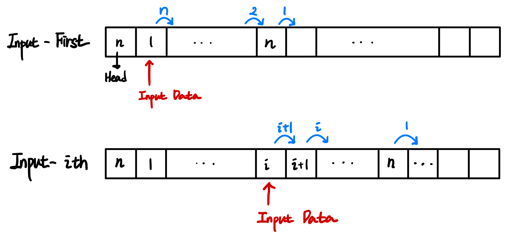
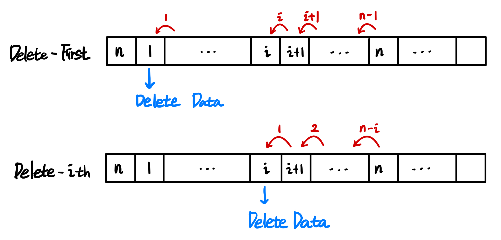
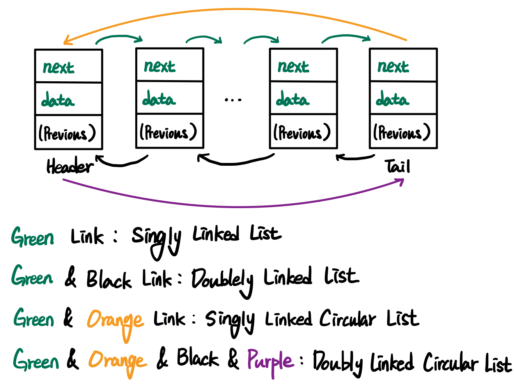
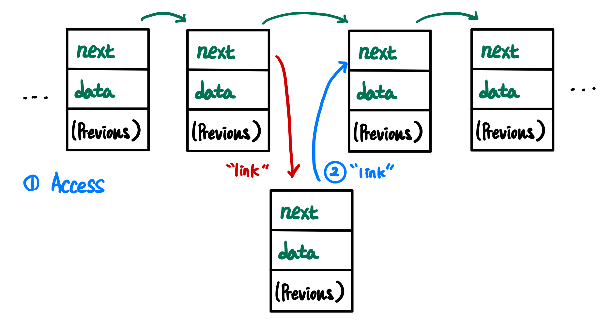
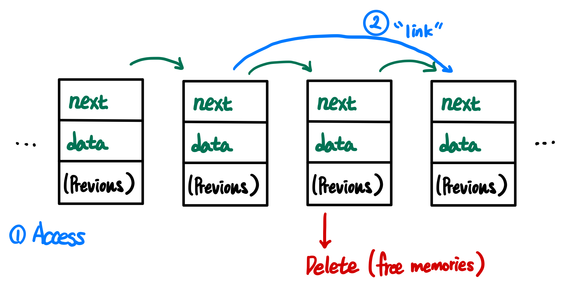

# 💡 List

List(리스트)는 연속된 공간에 같은 유형의 데이터를 순서가 정해진 채로 저장하는 자료 구조

- [A, B, C] != [C, B , A]

## 📌 Array(배열) VS List(리스트)

공백의 허용 여부

- Array는 데이터 사이 빈 공간이 생겨도 유지
- List는 데이터 사이 빈 공간을 허용하지 않음

> 빈 공간을 허용하지 않기에 List는 Array에 대비해 저장 공간 상의 이점을 얻음

## 📌 Operations

### 1. Add

List의 처음과 끝, i 번째 자리에 Data를 추가하는 동작

### 2. Delete

List의 처음과 끝, i 번째 자리를 삭제하는 동작

### 3. Access

List의 처음과 끝, i 번째 자리 Data에 접근하는 동작

## 📌 2가지 종류의 List

### Array Based List

[Array(배열)](../Array/README.md)를 이용한 List입니다.

### Linked List

포인터를 통해 각 단위 개체(Cell | Node)가 연결된 리스트

- 사전에 최대 크기를 정해두지 않아도되기에, 배열 기반 리스트 보다 확장성이 좋음
- Header라는 특정한 Node가 존재하며, List의 시작점 역할을 수행
- Tail Node를 둔다면, 마지막 Node에 대한 연산이 간결해짐

#### Linked List의 종류

- **Singly Linked List**: 다음 Node를 가리키는 연결로만 이루어진 리스트
- **Doubly Linked List**: 다음 Node와 이전 Node를 가리키는 연결로 이루어진 리스트
- **Circular Linked List**: Tail Node가 다음 Node로 첫 번째 Node를 가리켜 순환 구조를 형성한 리스트

#### Linked List Operations에 대한 시간 복잡도(Time Complexity)

- Access: `O(n)`
- Add & Delete
  - at First & Last: `O(1)`
    - 단, Tail Node 가 없다면 Last에 대한 연산은 `O(n)`
  - at k-th: `O(n)`

