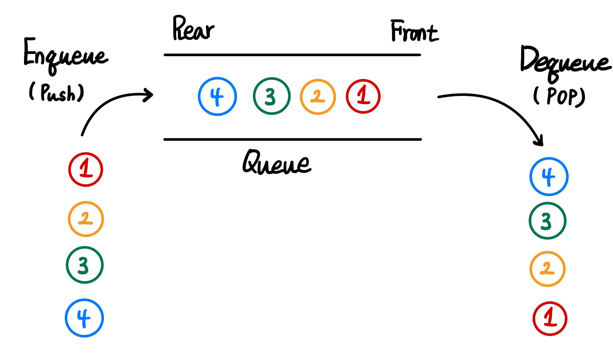
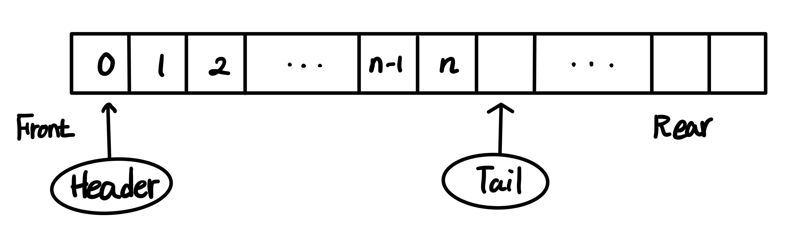
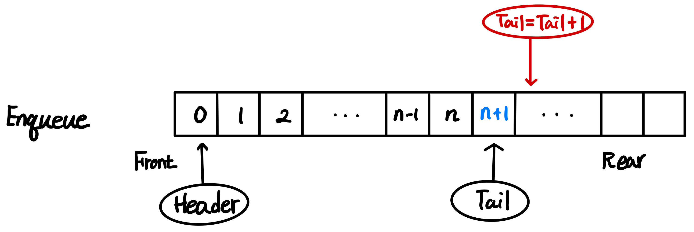
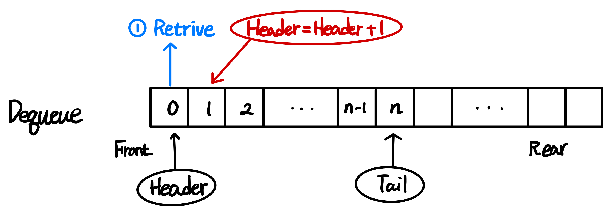
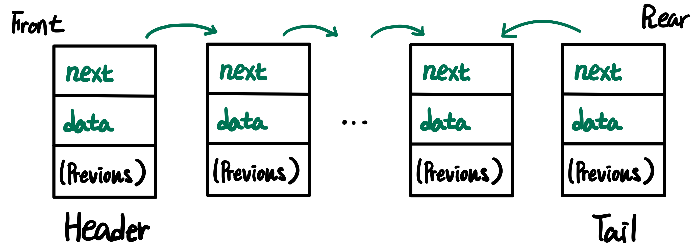
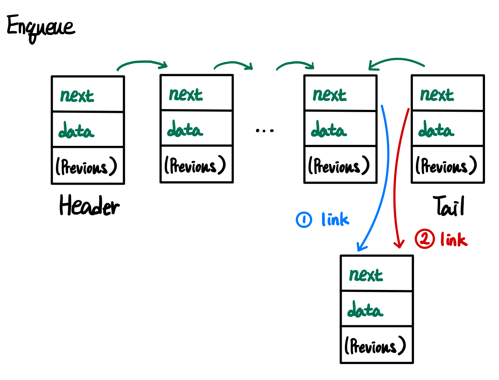
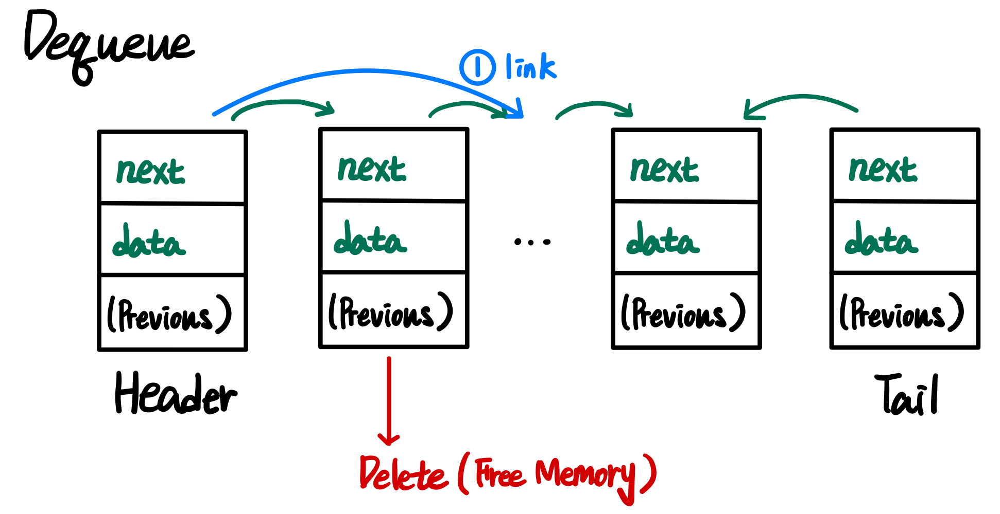

# Queue

Queue(큐)는 FIFO(First In First Out) 특성을 갖는 자료구조

## 📌 FIFO

First In First Out은 처음에 추가된 데이터가 가장 먼저 나감을 의미

## 📌 Operations

### Enqueue

Queue의 마지막에 데이터를 추가하는 동작

### Dequeue

Queue의 처음에서 데이터를 제거하는 동작

## 📌 2가지 종류의 Queue

### Array Based Queue

[Array(배열)](../Array/README.md)를 이용한 Queue.

- 데이터를 저장하기 위한 변수 외에도 header, tail 변수가 필요

- Enqueue

  

- Dequeue

  

- 순환 배열로 표현하는 것이 효율적

### Linked list Based Queue

[Linked List](../List/README.md#linked-list)를 이용한 Queue

- Enqueue

  

- Dequeue

  
