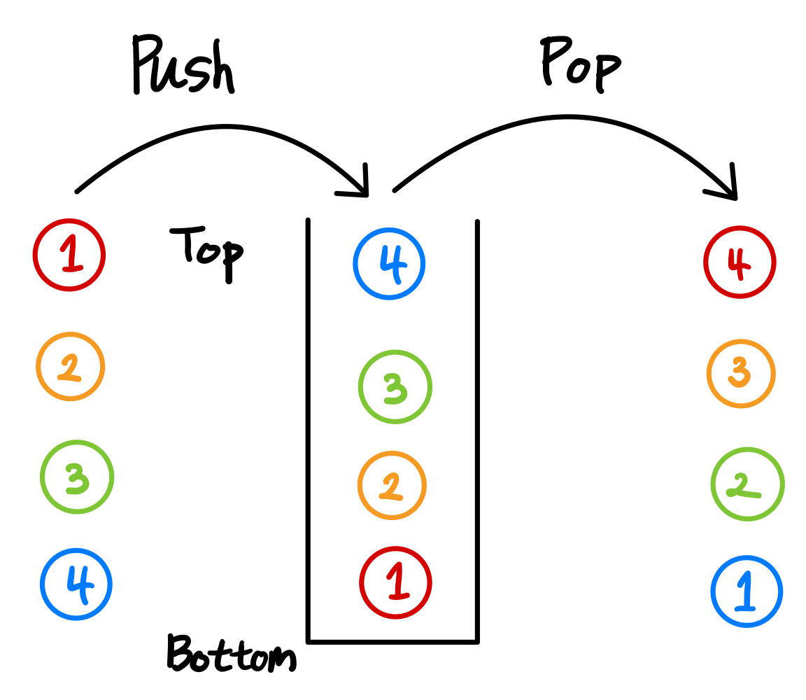
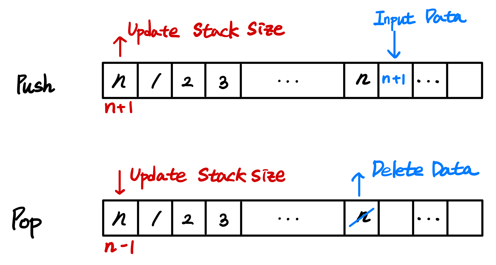
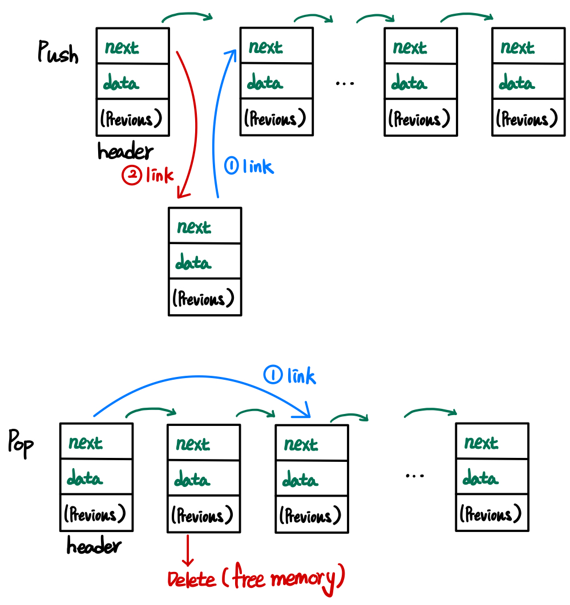

# 💡 Stack

Stack(스택)은 LIFO(Last In First Out) 특성을 갖는 자료구조

## 📌 LIFO

Last In First Out은 마지막에 추가된 데이터가 가장 먼저 나감을 의미 합니다.

## 📌 Operations

### 1. push

Stack의 Top에 데이터를 추가하는 동작

## 2. pop

Stack의 Top에서 데이터를 제거하는 동작

## 📌 2가지 종류의 Stack

### Array Based Stack

[Array(배열)](../Array/README.md)를 이용한 Stack

### Linked List Based Stack

[Linked List](../List/README.md#linked-list)를 이용한 Stack

