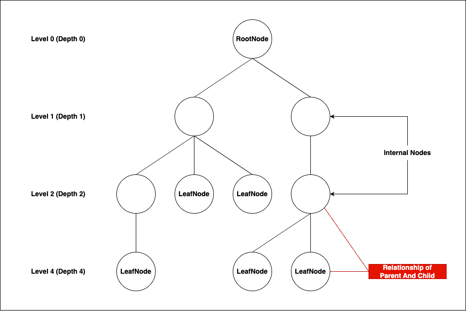
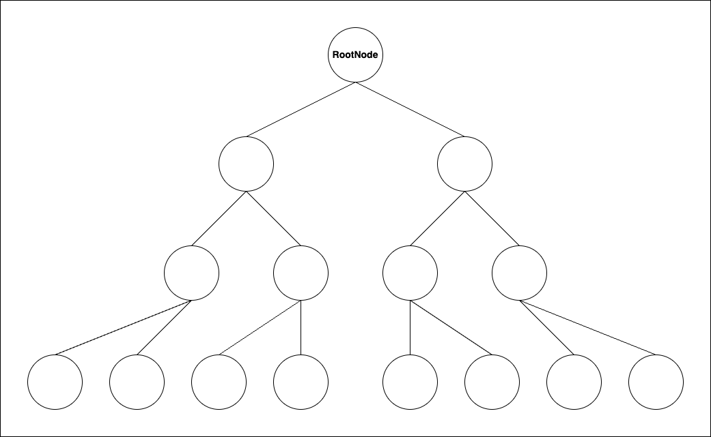
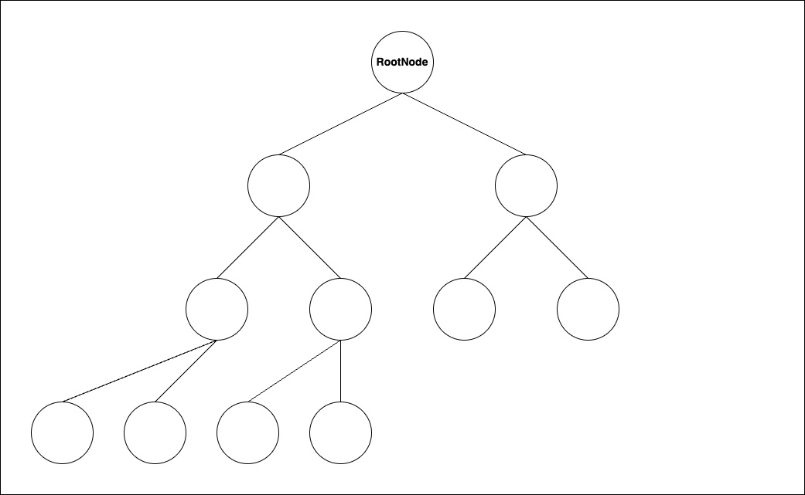
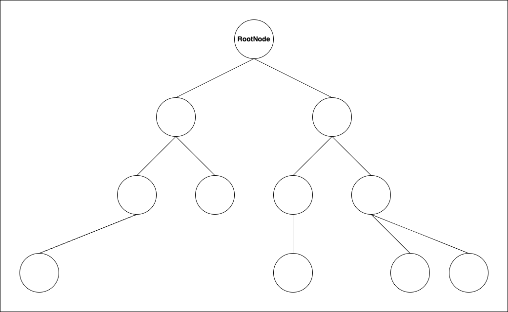
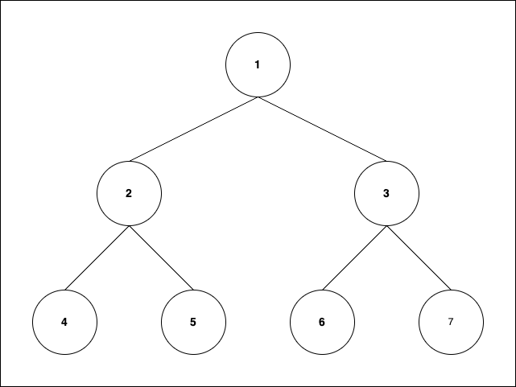

# 💡 Tree

연결된 Node 집합을 가진 계층적 구조

## 📌 Tree의 특성

- 트리는 `Node` 와 `Edge` 로 구성된다.
- RootNode 를 제외 한다면 모든 노드는 단 한 개의 ParentNode를 갖는다.
- 두 개의 Node 사이에는 항상 단 하나의 경로가 있다. (`비순회구조` 이다.)
- RootNode가 결정되면, 모든 Node 는 특정한 `Level` 혹은 `Depth` 가 결정된다.

## 📌 Tree의 구성 요소

### Node

Tree 자료구조를 형성하는, 데이터를 가진 최소 단위

#### Parent & Child Node

- `Parent Node`: 상위 계층에 있는 Node
- `Child Node`: Parent Node에 연결되어 하위 계층에 있는 Node

#### RootNode

Parent Node가 없는 유일한 Node이다.

#### LeafNode

Tree의 최하위 Level에 있는 Node이다.

### Edge

연결된 Node들을 표현하는 단위이다.

### Height of Node

RootNode와 LeafNode 간 가장 긴 경로의 길이이다.

### Level(Depth)

RootNode로 부터 떨어진 거리이다.

## 📌 Binary Tree

- 모든 Node의 Child Node가 최대 2개인 Tree이다
- Root Node를 기준으로 왼쪽 SubTree와 오른쪽 SubTree가 모두 Binary Tree인 Tree

### Binary Tree의 종류

#### Full Binary Tree

- LeafNode까지 모든 노드들이 2개의 ChildNode를 가지고 있는 Binary Tree
- 모든 Full Binary Tree는 Complete Binary Tree

#### Complete Binary Tree

- 마지막 Level의 Node들은 모두 채워져있고, 마지막 Level의 왼쪽의 LeafNode들 부터 채워진 상태의 Binary Tree
- 모든 Complete Tree는 Balanced Binary Tree

#### Balanced Binary Tree

- Node들이 가득 채워지지 않은 상태의 Binary Tree

### Binary Tree 순회

- Binary Tree의 순회는 방문한 Node의 데이터를 언제 다룰 것인지에 따라 3가지 방법이 존재

#### Preorder: VLR

1. Visit Node
1. Visit the Left Subtree
1. Visit the Right Subtree

- 방문 결과: 1 - 2 - 4 - 5 - 3 - 6 - 7

#### Inorder: LVR

1. Visit the Left Subtree
1. Visit Node
1. Visit the Right Subtree

- 방문 결과: 4 - 2 - 5 - 1 - 6 - 3 - 7

#### Postorder: LRV

1. Visit the Left Subtree
1. Visit the Right Subtree
1. Visit Node

- 방문 결과: 4 - 5 - 2 - 6 - 7 - 3 - 1

## 📌 Binary Search Tree (BST)

- 각 Node의 Subtree가 정렬된 관계를 갖는 Tree
- 모든 Left Subtree는 현재 노드의 값보다 작다
- 모든 Right Subtree는 현재 노드의 값보다 크다

### 특성

- Inorder 순회를 하면 Key가 오름차순으로 정렬된 결과를 얻는다
- 중복된 Key는 허용하지 않는 것이 일반적이다

### Operations

#### Search

RootNode부터 Key를 비교하며 탐색한다. 현재 Node의 Key보다 작으면 Left Subtree로, 크면 Right Subtree로 이동하며 일치하는 Key를 찾을 때까지 반복한다.

#### Insert

RootNode부터 Key를 비교하며 삽입할 위치를 탐색한다. LeafNode에 도달하면 해당 위치에 새로운 Node를 생성하여 연결한다.

#### Delete

삭제 대상 Node의 ChildNode 수에 따라 3가지 경우로 나뉜다.

- **LeafNode 삭제**: 해당 Node를 바로 제거한다
- **ChildNode가 1개**: 삭제할 Node를 제거하고, ChildNode를 ParentNode에 연결한다
- **ChildNode가 2개**: Inorder Successor(오른쪽 Subtree의 최솟값) 또는 Inorder Predecessor(왼쪽 Subtree의 최댓값)로 대체한 뒤, 대체된 Node를 삭제한다

### 시간 복잡도

- 평균: `O(log n)` — Tree가 균형 잡힌 경우
- 최악: `O(n)` — 한쪽으로 편향된(Skewed) Tree인 경우

### BST의 한계

삽입 순서에 따라 한쪽으로 편향된 Tree가 될 수 있으며, 이 경우 연결 리스트와 동일한 `O(n)` 성능을 갖는다. 이 문제를 해결하기 위해 스스로 균형을 유지하는 Self-Balancing BST가 등장했다.

## 📌 AVL(Adelson-Velskiiand Landis) Tree

모든 Node에서 Left Subtree와 Right Subtree의 높이 차이가 1 이하인 Self-Balancing BST이다. 삽입이나 삭제 시 균형이 깨지면 Rotation을 통해 자동으로 균형을 복원한다.

### Balance Factor

`Balance Factor = Left Subtree 높이 - Right Subtree 높이`

- 모든 Node의 Balance Factor는 `{-1, 0, 1}` 범위를 유지해야 한다
- 이 범위를 벗어나면 해당 Node를 기준으로 Rotation을 수행한다

### Rotation

균형이 깨진 Node를 기준으로 4가지 유형의 Rotation이 존재한다.

#### LL Rotation (Right Rotation)

Left Subtree의 Left에 삽입되어 균형이 깨진 경우, 오른쪽으로 회전한다.

#### RR Rotation (Left Rotation)

Right Subtree의 Right에 삽입되어 균형이 깨진 경우, 왼쪽으로 회전한다.

#### LR Rotation (Left-Right Rotation)

Left Subtree의 Right에 삽입되어 균형이 깨진 경우, Left Rotation 후 Right Rotation을 수행한다.

#### RL Rotation (Right-Left Rotation)

Right Subtree의 Left에 삽입되어 균형이 깨진 경우, Right Rotation 후 Left Rotation을 수행한다.

### Operations

- **Insert**: BST와 동일하게 삽입 후, 삽입 경로의 Node들에 대해 Balance Factor를 확인한다. 균형이 깨진 Node가 있으면 적절한 Rotation을 수행한다.
- **Delete**: BST와 동일하게 삭제 후, 삭제 경로의 Node들에 대해 Balance Factor를 확인하고 필요 시 Rotation을 수행한다.

### 시간 복잡도

항상 균형을 유지하므로 Search, Insert, Delete 모두 `O(log n)`을 보장한다.

## 📌 B-Tree

디스크 기반 저장 시스템에 최적화된 다방향 탐색 트리(Multiway Search Tree)이다. 하나의 Node가 여러 개의 Key를 가질 수 있어 Tree의 높이를 낮추고, 디스크 I/O 횟수를 줄인다.

### 차수(Order) m인 B-Tree의 특성

- 각 Node는 최대 `m - 1`개의 Key와 최대 `m`개의 ChildNode를 가진다
- RootNode를 제외한 모든 Node는 최소 `⌈m/2⌉ - 1`개의 Key를 가진다
- 모든 LeafNode는 같은 Level에 위치한다
- Node 내의 Key는 항상 오름차순으로 정렬된 상태를 유지한다

### Operations

#### Search

RootNode부터 시작하여 Node 내 Key들과 비교하며 탐색한다. 일치하는 Key가 없으면 적절한 범위의 ChildNode로 이동하여 반복한다.

#### Insert

LeafNode에 Key를 삽입한다. 삽입 후 Node의 Key 수가 `m - 1`을 초과하면 Node Split이 발생한다. 중간 Key를 ParentNode로 올리고, 나머지를 두 Node로 분할한다. Split은 ParentNode로 전파될 수 있다.

#### Delete

삭제 후 Node의 Key 수가 최소 조건 미만이 되면 재조정이 필요하다.

- **Redistribution**: 형제 Node에서 Key를 빌려온다
- **Merge**: Redistribution이 불가능하면 형제 Node와 병합한다

### 시간 복잡도

Tree 높이가 `O(log n)`으로 유지되므로 Search, Insert, Delete 모두 `O(log n)`이다.

### 활용

- 데이터베이스 인덱스(MySQL InnoDB 등)와 파일 시스템(NTFS, ext4 등)에서 널리 사용된다
- 디스크 접근 횟수를 최소화해야 하는 대용량 데이터 처리에 적합하다
